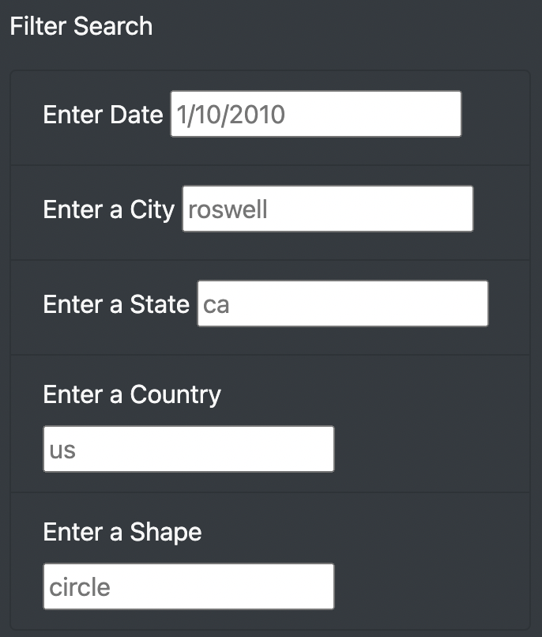
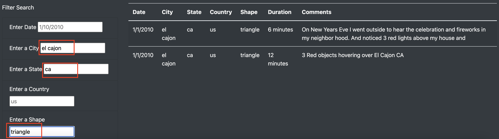

# **MULTIPLE FILTERS ON THE UFO SIGHTINGS PAGE**

## ***OVERVIEW***

### The purpose of this analysis is to provide Dana with a newer version of the web page that allows the user to not only use the date but also add additional filters such as city, state, country and shape, in order to improve the UFO sightings analysis.

## ***RESULTS***

### **How the new design works?**

#### Now with the new design, the user can select several filters at the same time, as we can see below:

#### By entering more than 1 filter at a time, the user can greatly improve the search, as we can appreciate in the folowwing image:

## ***SUMMARY***

### On drawback of the web page is that it requieres the user to enter the filter on a precise manner, otherwise the filter is not going to reflect anything at all. We can correct this with further development by adding at least the following features:
1. We can make the filters deploy a pre-defined list of options.
2. We can display a message to the user that they incorrectly typed an entry so to be able to correct it immediately.

### This would definitely improve the user experience by providing more interaction with the web page.
